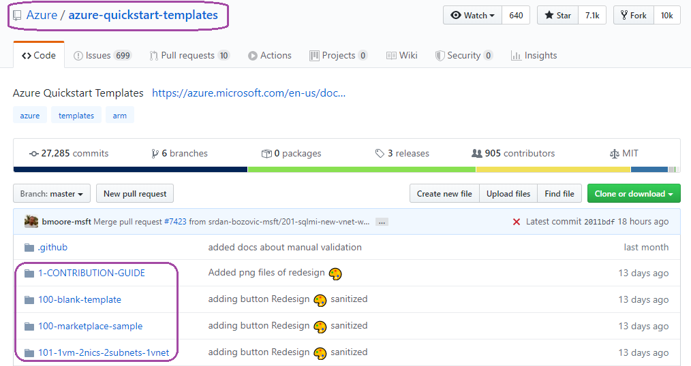
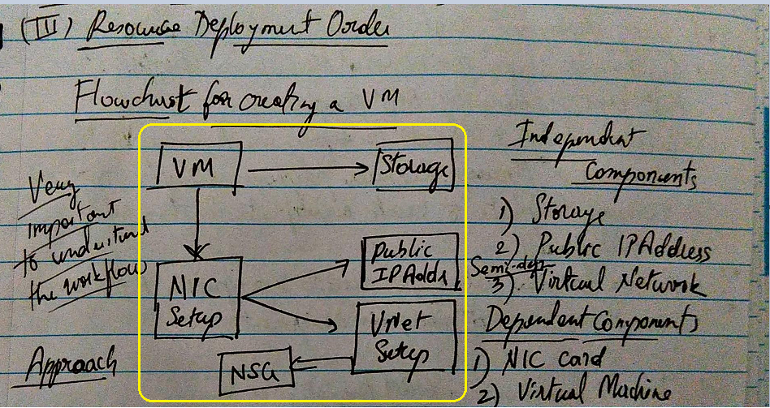

# az-arm-advance-templates
A detailed run on few of the advance topics of ARM

## Index for different use-cases
### [1. Brief Introduction _(Before you start)_](#before-we-start)
### [2. Multi-resource creation](#multi-resource-creation)
### [3. Deploy a pre-defined template](#pre-defined-template)
### [4. Concurrent resource deployment](#concurrent-resource-creation)
### [5. Resource inter-dependency](#resource-inter-dependency)
### [6. How to get output for your ARM templates?](#arm-generate-output)
### [7. Usage of exported templates](#exported-templates)
### [8. Usage of quick start templates](#quick-start-templates)
### [9. Resource creation with tags](#resource-creation-tags)

--
--
--
--
--
--
--
### <a name="before-we-start"></a>1. Brief Introduction (_Before you start_)
To push these ARM templates to our Azure environment, we will rely on **PowerShell** & have the following **Azure Subscription details**, ready before we kick-off. 

:pushpin: **Pointer:**

I have shown the simulations for my subscription name. Feel free to use your subscription too :blush:

|Property|Definition|
|---|---|
|**Azure Subscription**|Pay-as-you-go|
|**Subscription Name**|_nags-azure-subscription_|
|**Resource Group Name**|_azure-lab-rg-01_|
|**Powershell Cmdlet**|_New-AzResourceGroupDeployment_|

Check your Powershell environment:

```
PS C:\WINDOWS\system32> (Get-AzContext).Subscription.Name
nags-azure-subscription

PS C:\WINDOWS\system32> (Get-AzContext).Subscription.id
XXXXXXXXX-YYYY-ABCD-EFGH-ABCDEFXYZ722

PS C:\WINDOWS\system32> (Get-AzContext).Subscription.State
Enabled
```

Before we create a new resource (within our resource group) using: _New-AzResourceGroupDeployment_, its advisable to familiarize with this cmdlet. You can choose its help function like given below.

```
PS C:\WINDOWS\system32> help New-AzResourceGroupDeployment -ShowWindow
```

### <a name="multi-resource-creation"></a>2. Multi-resource creation
|Property|Definition|
|---|---|
|Folder|[0-storage-vnet-creation](./0-storage-vnet-creation)|
|File|_azuredeploy.json_|
|ParameterFile|_azuredeploy.parameters.dev.json_|

Run this command to create a **storageaccount** & **virtualnetwork** simultaneously in your resource group. Here you need to understand the usage of **positional elements within array**, and the mechanism to invoke it.

Ex: in the addressSpace parameter, there are 2 array fields: _addressPrefixes & subnets_ defined, where each of them have multiple elements (_firstvnetPrefix & secondvnetPrefix; firstSubnet & secondSubnet_). 

Observe how these elements are referred during the creation of Vnet resources (ex for address space parameter, to extract the addressprefix of _firstvnetPrefix_, the reference call is _"[parameters('allAddrSpaces').addressPrefixes[0].addressPrefix]"_.

**Extract from the json file:**
```
/* parameter definition */
...
"allAddrSpaces":{
      "type": "object",
      "defaultValue": {
          /* "name":"VNet1", (not mandatory to mention the profile name) */
            "addressPrefixes": [
                {
                    "name": "firstvnetPrefix",
                    "addressPrefix": "10.0.0.0/16"
                },
                {
                    "name": "secondvnetPrefix",
                    "addressPrefix": "10.0.1.0/16"
                }
            ],
            "subnets":[
                {
                    "name": "firstSubnet",
                    "addressPrefix": "10.0.0.0/24"
                },
                {
                    "name":"secondSubnet",
                    "addressPrefix":"10.0.1.0/24"
                }
            ]
        }
    },
...

/* resource definition */
...
{
      "type": "Microsoft.Network/virtualNetworks",
      "apiVersion": "2019-11-01",
      "name": "[variables('vnetName')]",
      "tags": "[parameters('resourceTags')]",
      "location": "[parameters('location')]",
      "properties": {
          "addressSpace": {
            /* "addressPrefixes": "[parameters('vnetAddrSpace')]" */
            /* /* "type": "string", (not a string, but an object)*/
            "addressPrefixes": ["[parameters('allAddrSpaces').addressPrefixes[0].addressPrefix]", "[parameters('allAddrSpaces').addressPrefixes[1].addressPrefix]"]
            },
          "subnets": [
            {
              "name": "[parameters('allAddrSpaces').subnets[0].name]",
              "properties": {
                  "addressPrefix": "[parameters('allAddrSpaces').subnets[0].addressPrefix]",
                  "delegations": [],
                  "privateEndpointNetworkPolicies": "Enabled",
                  "privateLinkServiceNetworkPolicies": "Enabled"
                }
              },
...
```

**Command:**
```
PS C:\Users\nagarjun k\Documents\az-journey\arm\b-advance\0-storage-vnet-creation> 
New-AzResourceGroupDeployment -Name "storagevnetcreate" -ResourceGroupName "azure-lab-rg-01" \
-TemplateFile .\azuredeploy.json -TemplateParameterFile .\azuredeploy.parameters.dev.json -Verbose
```

**Output:**
```
VERBOSE: Performing the operation "Creating Deployment" on target "azure-lab-rg-01".
VERBOSE: 19:35:58 - Template is valid.
VERBOSE: 19:36:01 - Create template deployment 'storagevnetcreate'
VERBOSE: 19:36:06 - Resource Microsoft.Storage/storageAccounts 'dev12bxmueijtaz47c' provisioning status is running
VERBOSE: 19:36:06 - Resource Microsoft.Network/virtualNetworks 'dev12' provisioning status is running
VERBOSE: 19:36:22 - Resource Microsoft.Network/virtualNetworks 'dev12' provisioning status is succeeded
VERBOSE: 19:36:27 - Resource Microsoft.Storage/storageAccounts 'dev12bxmueijtaz47c' provisioning status is succeeded

DeploymentName          : storagevnetcreate
ResourceGroupName       : azure-lab-rg-01
ProvisioningState       : Succeeded
Timestamp               : 19-04-2020 14:06:28
Mode                    : Incremental
TemplateLink            :
Parameters              :
                          Name               Type                       Value
                          =================  =========================  ==========
                          mystoragePrefix    String                     dev12
                          storageSKU         String                     Standard_LRS
                          location           String                     southindia
                          vnet_name          String                     dev12
                          allAddrSpaces      Object                     {
                            "addressPrefixes": [
                              {
                                "name": "firstPrefix",
                                "addressPrefix": "10.7.0.0/16"
                              },
                              {
                                "name": "secondPrefix",
                                "addressPrefix": "10.8.0.0/16"
                              }
                            ],
                            "subnets": [
                              {
                                "name": "subnet-dev-A",
                                "addressPrefix": "10.7.0.0/24"
                              },
                              {
                                "name": "subnet-dev-B",
                                "addressPrefix": "10.8.0.0/24"
                              }
                            ]
                          }
                          resourceTags       Object                     {
                            "environment": "dev",
                            "lab-simulation": "arm-template-creation-dev"
                          }

Outputs                 :
                          Name               Type                       Value
                          =================  =========================  ==========
                          storageEndpoint    Object                     {
                            "services": {
                              "file": {
                                "enabled": true,
                                "lastEnabledTime": "2020-04-19T14:06:06.1041607Z"
                              },
                              "blob": {
                                "enabled": true,
                                "lastEnabledTime": "2020-04-19T14:06:06.1041607Z"
                              }
                            },
                            "keySource": "Microsoft.Storage"
                          }
                          storageStatus      String                     available
                          creationTime       String                     19-04-2020 14:06:06
                          vnetAddrSpace      Object                     {
                            "addressPrefixes": [
                              "10.7.0.0/16",
                              "10.8.0.0/16"
                            ]
                          }
                          vnetSubnet         Array                      [
                            {
                              "name": "subnet-dev-A",
                              "id": "/subscriptions/2f981ee7-6c60-4593-bc4b-82c9b050f722/resourceGroups/azure-lab-rg-01/providers/Microsoft.Network/virtualNetworks/dev12/subnets/subnet-dev-A",
                              "etag": "W/\"8b49ab4f-2ecf-4f9c-baf7-9813b12792d0\"",
                              "properties": {
                                "provisioningState": "Succeeded",
                                "addressPrefix": "10.7.0.0/24",
                                "delegations": [],
                                "privateEndpointNetworkPolicies": "Enabled",
                                "privateLinkServiceNetworkPolicies": "Enabled"
                              },
                              "type": "Microsoft.Network/virtualNetworks/subnets"
                            },
                            {
                              "name": "subnet-dev-B",
                              "id": "/subscriptions/2f981ee7-6c60-4593-bc4b-82c9b050f722/resourceGroups/azure-lab-rg-01/providers/Microsoft.Network/virtualNetworks/dev12/subnets/subnet-dev-B",
                              "etag": "W/\"8b49ab4f-2ecf-4f9c-baf7-9813b12792d0\"",
                              "properties": {
                                "provisioningState": "Succeeded",
                                "addressPrefix": "10.8.0.0/24",
                                "delegations": [],
                                "privateEndpointNetworkPolicies": "Enabled",
                                "privateLinkServiceNetworkPolicies": "Enabled"
                              },
                              "type": "Microsoft.Network/virtualNetworks/subnets"
                            }
                          ]
                          vnetPeeringInfo    Array                      []

DeploymentDebugLogLevel :
```

### <a name="pre-defined-template"></a>3. Deploy a pre-defined template
|Property|Definition|
|---|---|
|Folder|[1-quick-template-reference](./1-quick-template-reference)|
|File|_azuredeploy.json_|

We can always rely on the ["pre-defined" templates](https://github.com/Azure/azure-quickstart-templates) already provided for Azure resources (within github). It could save you a lot of configuration time and speed up new resource creation for any az service



**Command:**
```
PS C:\Users\nagarjun k\Documents\az-journey\arm\b-advance\1-quick-template-reference> 
New-AzResourceGroupDeployment -Name "quicktemplateusage" -ResourceGroupName "azure-lab-rg-01" \
-TemplateFile .\azuredeploy.json -Verbose
```

**Output:**
```
VERBOSE: Performing the operation "Creating Deployment" on target "azure-lab-rg-01".
VERBOSE: 19:40:46 - Template is valid.
VERBOSE: 19:40:49 - Create template deployment 'quicktemplateusage'
VERBOSE: 19:40:54 - Resource Microsoft.Storage/storageAccounts 'azstoragebxmueijtaz47c' provisioning status is running
VERBOSE: 19:41:18 - Resource Microsoft.Storage/storageAccounts 'azstoragebxmueijtaz47c' provisioning status is succeeded

DeploymentName          : quicktemplateusage
ResourceGroupName       : azure-lab-rg-01
ProvisioningState       : Succeeded
Timestamp               : 19-04-2020 14:11:18
Mode                    : Incremental
TemplateLink            :
Parameters              :
                          Name                    Type                       Value
                          ======================  =========================  ==========
                          storageReferenceName    String                     azstorage
                          storageAccountType      String                     Standard_LRS
                          location                String                     southindia

Outputs                 :
                          Name                       Type                       Value
                          =========================  =========================  ==========
                          stgaccounstgnetworkacls    Object                     {
                            "bypass": "AzureServices",
                            "virtualNetworkRules": [],
                            "ipRules": [],
                            "defaultAction": "Allow"
                          }
                          stgencryption              Object                     {
                            "services": {
                              "file": {
                                "enabled": true,
                                "lastEnabledTime": "2020-04-19T14:10:54.7900009Z"
                              },
                              "blob": {
                                "enabled": true,
                                "lastEnabledTime": "2020-04-19T14:10:54.7900009Z"
                              }
                            },
                            "keySource": "Microsoft.Storage"
                          }
                          stgccesstier               String                     Hot
                          stglocation                String                     southindia
                          stgendpoints               Object                     {
                            "dfs": "https://azstoragebxmueijtaz47c.dfs.core.windows.net/",
                            "web": "https://azstoragebxmueijtaz47c.z30.web.core.windows.net/",
                            "blob": "https://azstoragebxmueijtaz47c.blob.core.windows.net/",
                            "queue": "https://azstoragebxmueijtaz47c.queue.core.windows.net/",
                            "table": "https://azstoragebxmueijtaz47c.table.core.windows.net/",
                            "file": "https://azstoragebxmueijtaz47c.file.core.windows.net/"
                          }

DeploymentDebugLogLevel :
```

### <a name="concurrent-resource-creation"></a>4. Concurrent resource deployment
|Property|Definition|
|---|---|
|Folder|[2-multiple-concurrent-copies](./2-multiple-concurrent-copies)|
|File|_azuredeploy.json_|

Sometimes there are scenarios, where you might need to **deploy multiple, identical copy of az resources**, which can be accomplished by usage of _copyIndex_ function. Below we are trying to **create 3 storage accounts of identical configuration** in the same region 

```
/* resource definition */
...
"resources": [
    {
      "type": "Microsoft.Storage/storageAccounts",
      "apiVersion": "2019-04-01",
      // dont need to reference any variable as its already commented out
      // "name": "[variables('storageAccountName')]",
      "name": "[concat(copyIndex(),'azstorage', uniqueString(resourceGroup().id))]",
      "location": "[parameters('location')]",
      "sku": {
        "name": "[parameters('storageAccountType')]"
      },
      "kind": "StorageV2",
      "copy": {
          "name": "azstoragecopy",
          "count": 3
        },
...
```

:memo: **Key pointer:**

When you are trying to create identical copy of the az resources, **please dont declare a parameter or variable explicitly**, as it works well if the resource name is directly coded during its creation

**Command:**
```
PS C:\Users\nagarjun k\Documents\az-journey\arm\b-advance\2-multiple-concurrent-copies> 
New-AzResourceGroupDeployment -Name "multipleresourcecreation" -ResourceGroupName "azure-lab-rg-01" \
-TemplateFile .\azuredeploy.json -Verbose
```

**Output:**
```
VERBOSE: Performing the operation "Creating Deployment" on target "azure-lab-rg-01".
VERBOSE: 19:49:08 - Template is valid.
VERBOSE: 19:49:10 - Create template deployment 'multipleresourcecreation'
VERBOSE: 19:49:16 - Resource Microsoft.Storage/storageAccounts '0azstoragebxmueijtaz47c' provisioning status is running
VERBOSE: 19:49:35 - Resource Microsoft.Storage/storageAccounts '1azstoragebxmueijtaz47c' provisioning status is running
VERBOSE: 19:49:35 - Resource Microsoft.Storage/storageAccounts '2azstoragebxmueijtaz47c' provisioning status is running
VERBOSE: 19:49:40 - Resource Microsoft.Storage/storageAccounts '1azstoragebxmueijtaz47c' provisioning status is succeeded
VERBOSE: 19:49:40 - Resource Microsoft.Storage/storageAccounts '2azstoragebxmueijtaz47c' provisioning status is succeeded
VERBOSE: 19:49:40 - Resource Microsoft.Storage/storageAccounts '0azstoragebxmueijtaz47c' provisioning status is succeeded

DeploymentName          : multipleresourcecreation
ResourceGroupName       : azure-lab-rg-01
ProvisioningState       : Succeeded
Timestamp               : 19-04-2020 14:19:41
Mode                    : Incremental
TemplateLink            :
Parameters              :
                          Name                    Type                       Value
                          ======================  =========================  ==========
                          storageReferenceName    String                     azstorage
                          storageAccountType      String                     Standard_LRS
                          location                String                     southindia

Outputs                 :
DeploymentDebugLogLevel :
```

### <a name="resource-inter-dependency"></a>5. Resource Inter-dependency
|Property|Definition|
|---|---|
|Folder|[3-resource-inter-dependency](./3-resource-inter-dependency)|
|File|_azuredeploy.json_|
|ParameterFile|_azuredeploy.parameters.dev.json_|

At times, there will be a need to create a complex azure resource which interfaces (either directly or indirectly) with other az resources. Its important to know the **"sequential-order-of-creation"** to help create first the independent resource & then the dependent resource for the right execution.

For ex: look at creation of a simple VM (see diagram below). 

a. **VM Creation** depends on 2 main components: _Storage Account_ & _Network-Interface-Card_

b. NIC itself depends on _Public IP Address & Virtual Network_ to be ready & online before it can be instantiated

c. And lastly VNet depends entirely on a uniform "incoming/outgoing traffic" ruleset, namely: _Network Security Groups"_ which can be safely attached to its Subnet during VM creation



So its always advisable from the order of creation to

I. first **create independent components** (ex: _Storage account & Public IP Address_)

II. then **create "semi-independent" components**  with first layer of dependency (ex: _Vnet & NSG_)

III. and lastly, after all the other components (ex: _Storage account, Public IP Addr, Vnet, NSG_) are in place, you can safely create the NIC & then eventually the VM

:pushpin: **Key Pointer(s):**

1. Before proceeding to **create a multi-component resource**, please make **a simple flowchart of dependent & independent components**, as it helps in prioritization

2. Secondly, its recommended to attach NSG to subnet to homogenize the traffic security of VM's

3. And lastly, this VM creation process can be extended to add the next set of components such as **PS Desired Confiuguration/Custom Script extension**

